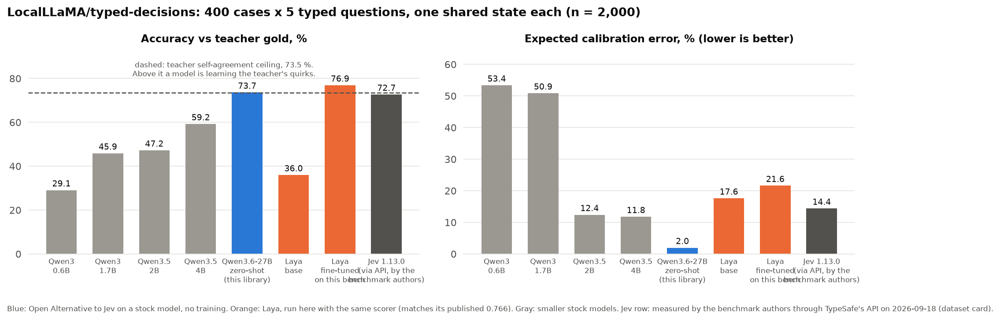
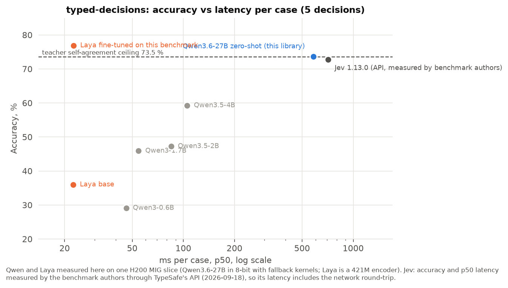

# Open Alternative to Jev

[](https://huggingface.co/spaces/IkerMoel/open-alternative-jev) [](LICENSE) [](https://github.com/ikermoel/open-alternative-jev/actions/workflows/ci.yml)

**Open-source System One models: typed, calibrated decisions from any open-weights LLM, in one forward pass.**
An open alternative to the idea behind TypeSafe's Jev, running on your own GPU with models you already have.
Python package `open-alternative-jev`, import name `so1` ("System One").
Also known as: open Jev, Jev alternative, open-source System One model.

> **Beats Jev on the community benchmark, with no training.** On `LocalLLaMA/typed-decisions` (400 cases, 2,000
> typed decisions), a stock Qwen3.6-27B through this library scores **73.7 % accuracy, KL to gold 0.27, ECE 0.020, 582 ms
> per case** (one H200 MIG slice, 8-bit). Jev 1.13.0, measured by the benchmark's authors through TypeSafe's API on
> 2026-09-18: **72.7 %, KL 1.44, ECE 0.144, 710 ms per case**. Higher accuracy, probabilities five times closer to the
> gold distribution, and lower latency, zero-shot. Same third-party scorer, which reproduces Laya's published numbers
> exactly. [Details and caveats below.](#against-jev-and-laya-on-a-shared-benchmark)
This replaces the library, not the endpoint: it is a Python package you call in-process, and there is no HTTP server
or drop-in API for the official Jev SDK.

**Try it now:** [live demo on Hugging Face Spaces](https://huggingface.co/spaces/IkerMoel/open-alternative-jev) with Qwen3.5-4B, no install. No text is generated: the model reads the state once and every question is answered from the next-token distribution at its own position, restricted to the options you give.

## Results

Qwen3.6-27B (bitsandbytes 8-bit), one H200 MIG slice with 35 GB, Hugging Face Transformers. Every number
below comes from `benchmarks/results/`, produced by the scripts in `benchmarks/scripts/`.

**RACE-H, 250 passages x 4 questions (n = 1000).** One passage, four multiple-choice questions.
This is the shared-state case the library is built for.

| Mode | Accuracy | Questions / s | Tokens processed |
|---|---:|---:|---:|
| A: one question per forward | 92.6 % | 1.66 | 468,583 |
| B: batch of 4 (padding) | 92.8 % | 2.00 | 481,924 |
| **Open Alternative to Jev** (packed, state written once) | **92.9 %** | **4.55** | **186,898** |


Packing writes the passage once instead of four times: 2.5x fewer tokens, 2.3x the throughput of batching,
same accuracy (Open Alternative to Jev minus A = +0.3 points, 95 % CI -0.9 to +1.4, bootstrap over passages).

**MMLU, 1200 questions, no shared state.** Accuracy holds up to 12 questions per sequence.

| Mode | Accuracy | Questions / s | Tokens processed |
|---|---:|---:|---:|
| A: one question per forward | 84.2 % | 3.10 | 163,032 |
| B: batch of 3 (padding) | 83.8 % | 3.88 | 253,638 |
| Open Alternative to Jev, 3 packed | 84.0 % | 5.44 | 165,432 |
| Open Alternative to Jev, 6 packed | 84.9 % | 6.21 | 166,032 |
| Open Alternative to Jev, 12 packed | 84.2 % | 6.71 | 166,332 |


Read the MMLU speed column carefully: without a shared state, packing does not reduce compute per token.
It is faster here because batch B wastes 36 % of its tokens on padding and because each forward call has a
fixed cost that packing amortizes. A serving engine with continuous batching and no padding would close
most of that gap. The RACE-H gain is structural and survives any engine.

> **The correction that made this README honest.** Our first pilot reported "1.4x faster than batching" on
> MMLU. Regressing forward time on token counts showed that B and C cost exactly the same per token
> (0.96 vs 0.97 ms) and that the whole difference was padding waste in the batch. We kept the pilot and the
> analysis in the write-up `benchmarks/docs/RESULTS.md` so you can check the reasoning, and we designed the
> RACE-H run so that the baseline had almost no padding (2.8 %).

### Interference: accuracy holds, individual answers move

Later questions in a packed sequence can attend to earlier questions and to the placeholders between them.
We measured the effect against a clean noise floor: the same prompt, one at a time, but right-padded to a
fixed length (`A_pad`) changes 2.7 % of answers purely through kernel numerics. Packing changes 6-9 %.


The changes are symmetric, so aggregate accuracy does not drop, but a given decision can differ depending
on which questions accompany it, and on their order (rotating the order changes 8 % of MMLU answers,
2.4 % of RACE-H answers). If you need answer-level stability, use `mode="separate"`.

### Calibration: one scalar, fitted on held-out labels

Raw confidence is about 5 points too high (mean confidence 0.90, accuracy 0.84 on MMLU). Temperature
scaling with a single scalar, fitted on one half and evaluated on the other, brings the expected
calibration error from 5.4 % to 2.1 % on MMLU and from 2.8 % to 1.1 % on RACE-H. Packed modes come out
less over-confident than one-at-a-time scoring; RACE-H packed was already close to calibrated (T = 1.0-1.1)
and scaling does not help it.


```python
from so1 import TemperatureScaler
scaler = TemperatureScaler().fit(probabilities, correct_indices)   # a few hundred labelled decisions
calibrated = [scaler.apply(d) for d in decisions]
```

### The library itself, on both backends

Same code path users get, on a smaller model: Qwen3.5-4B (BF16), RACE-H, 100 passages x 4 questions, one
H200 MIG 3g.71gb slice. Wall-clock time per question including tokenization, from `benchmarks/scripts/library_compare.py`
(run `lib_race_32698399`).

| Backend / mode | Accuracy | Questions / s | Tokens sent | Agreement with HF separate |
|---|---:|---:|---:|---:|
| Transformers, `separate` | 87.3 % | 20.0 | 179,807 | |
| Transformers, `packed` | 84.5 % | 49.6 | 71,216 | 93.8 % |
| vLLM, `separate` (prefix cache + `allowed_token_ids`) | 87.0 % | 71.9 | 179,807 | 99.8 % |
| vLLM, `packed` (`prompt_logprobs`) | 84.3 % | 38.7 | 71,216 | 93.8 % |

Three things this table says that the 27B tables do not:

- **Small models pay for packing.** On the 4B model, packing costs 2.8 points (11 of 400 answers), where the
  27B lost nothing. Interference grows as the model shrinks. With small models and accuracy at stake, use
  `mode="separate"`.
- **On vLLM, `separate` is the fastest mode.** Prefix caching already computes the shared passage once, and
  constrained one-token generation is cheaper than extracting top-k `prompt_logprobs` at every position.
  Packing's throughput advantage is a property of engines without a prefix cache, such as plain Transformers.
- **The two backends agree.** In `separate` mode, vLLM and Transformers pick the same answer 99.8 % of the
  time, with a mean absolute probability difference of 0.003.

So the recommendation is simple: on Transformers, pack when questions share a state; on vLLM, keep
`separate` and let the prefix cache do the work. Either way you get typed answers with probabilities, no
generated text, and the same calibration tools.

### Against Jev and Laya on a shared benchmark

`LocalLLaMA/typed-decisions` is the benchmark the community uses for this task: 400 cases, each one shared
state plus 5 typed questions (yes/no, choice, ordered score), gold built from a teacher model. Everything
below is scored with the same code as the third-party [Luni/laya-jev-benchmark](https://huggingface.co/datasets/Luni/laya-jev-benchmark)
table; we verified the scorer by running Laya ourselves and reproducing its published numbers exactly
(base 0.360 / ECE 0.176, fine-tuned 0.766 / ECE 0.213). The Jev row is not a TypeSafe publication: it is the
measurement the benchmark's authors took through TypeSafe's API (`jev-latest`, reporting itself as 1.13.0) on
2026-09-18, all 400 cases. Zero-shot, no training, `benchmarks/scripts/typed_decisions.py`.

| Model | Training | Source | Accuracy | ECE | Brier | ms / case (5 decisions) |
|---|---|---|---:|---:|---:|---:|
| Qwen3-0.6B | zero-shot | measured here | 29.1 % | 0.534 | 0.672 | 46 |
| Qwen3-1.7B | zero-shot | measured here | 45.9 % | 0.509 | 0.682 | 55 |
| Qwen3.5-2B | zero-shot | measured here | 47.3 % | 0.124 | 0.269 | 85 |
| Qwen3.5-4B | zero-shot | measured here | 59.3 % | 0.118 | 0.164 | 105 |
| Laya base, 421M | trained on its own data, not this benchmark | measured here | 36.0 % | 0.176 | 0.329 | 23 |
| Jev 1.13.0 | proprietary, unknown | measured by the benchmark authors via TypeSafe's API, 2026-09-18 | 72.7 % | 0.144 | 0.148 | 710 |
| **Qwen3.6-27B (8-bit), Open Alternative to Jev** | **zero-shot** | **measured here** | **73.7 %** | **0.020** | 0.113 | 582 |
| Teacher self-agreement ceiling | | | 73.5 % | | | |
| Laya fine-tuned, 421M | fine-tuned on this benchmark's train split | measured here | 76.9 % | 0.216 | 0.066 | 23 |





- **A stock 27B with no training edges the Jev measurement** (73.7 % vs 72.7 %, a one-point gap that is
  within noise on 2,000 decisions) and sits on the teacher self-agreement ceiling (73.5 %). The benchmark's
  own card says a score much above 0.75 means a model has learned the teacher's quirks rather than the task.
- **Its probabilities track the gold distribution far better.** KL to gold 0.27 against Jev's 1.44 and
  Brier 0.113 against 0.148. The card itself warns that ECE alone misleads here (a base-rate "prior" that
  reads nothing has ECE 0.088) and asks for KL and Brier; on those, the stock 27B is the best general model
  in the table. Its ECE (0.020) is also the lowest of any model that reads the input.
- **Latency.** 582 ms per case here, p50, on one H200 MIG slice with 8-bit weights and fallback kernels;
  Jev's 710 ms is the API round-trip measured by the benchmark authors. Different conditions, so read it
  as "the same order of magnitude", not as a race.
- **Laya fine-tuned scores higher and is worse everywhere else.** It was trained on this benchmark's train
  split, exceeds the ceiling, and its probabilities are badly calibrated. Laya base, the checkpoint that has
  not seen the task, scores 36 %.
- **Packing helps here.** Five questions about one state answered in one pass beat the same questions asked
  separately on every model of 2B and up (27B: 73.7 % vs 72.7 %; 4B: 59.3 % vs 56.0 %). Below 2B the
  opposite holds and accuracy collapses either way: this is a 4B-and-up method.
- **Laya is a 421M encoder and is 25x faster per case** than the 27B; that is the trade the small trained
  models make.
- Temperature scaling fitted on 200 train cases to the teacher's soft distributions improves Brier and KL
  (27B: 0.113 to 0.074) but raises hard-label ECE (0.020 to 0.135), so the calibrated rows are in
  `benchmarks/results/td_*_cal_*` rather than in this table.

## Quickstart

```python
from so1 import Decider, Choice, yes_no

decider = Decider.from_pretrained("Qwen/Qwen3.6-27B", backend="hf", load_in_8bit=True)
decisions = decider.decide(
    state="Ticket #8813: 'Since yesterday's release the export button does nothing. Board meeting Monday.'",
    questions=[
        Choice("Ticket category", ["bug", "feature request", "billing", "question"]),
        Choice("Urgency", ["low", "medium", "high"]),
        yes_no("Escalate to an engineer?"),
    ],
)
for d in decisions:
    print(d.choice, round(d.confidence, 2))   # bug 0.83 / high 0.71 / yes 0.77
```

The answer is always one of your options, and it comes with a probability.

## Install

```bash
pip install open-alternative-jev            # Hugging Face backend
pip install "open-alternative-jev[vllm]"    # + vLLM backend
pip install "open-alternative-jev[quant]"   # + bitsandbytes 8-bit / 4-bit loading
```

Python 3.10+. Works on CPU for small models (the test suite runs on Qwen2.5-0.5B on a laptop).

## How it works

```
<|im_start|>user
Choose the correct option. Reply with only its letter.

Context:
<your state>

Question: <question 1>
A. option   B. option   C. option<|im_end|>
<|im_start|>assistant
<think></think>            <- readout 1: next-token distribution over A/B/C
_<|im_end|>                <- fixed placeholder, never the model's own answer
<|im_start|>user
Answer the following question about the same context. Reply with only the letter.

Question: <question 2> ...<|im_end|>
<|im_start|>assistant
                           <- readout 2
```

1. Each question is rendered as a normal chat turn, so the model sees a format it was trained on.
2. The turns are concatenated into one token sequence with a fixed placeholder answer between them.
3. One forward pass; logits are read only at the readout positions (`logits_to_keep` on Transformers,
   `prompt_logprobs` on vLLM).
4. The logits of the option letters are normalized with a softmax. Nothing outside your options can win.
5. Optionally, a fitted temperature turns the raw probabilities into calibrated ones.

Two modes:

- `mode="packed"` (default): one sequence per state, all its questions inside. Fastest with a shared state.
- `mode="separate"`: one sequence per question, each with the full state. No interference between
  questions. On vLLM this uses constrained generation with `allowed_token_ids` and shares the state
  through the prefix cache, which is the conventional baseline.

## Backends

| | Hugging Face Transformers | vLLM |
|---|---|---|
| Load | `Decider.from_pretrained(id, backend="hf", load_in_8bit=True)` | `Decider.from_pretrained(id, backend="vllm", gpu_memory_utilization=0.85)` |
| Packed readout | exact logits at each position | top-k `prompt_logprobs` (k = 20); labels outside top-k get a floor, counted in `backend.missing_labels` |
| Separate readout | exact | exact (`allowed_token_ids` + processed logprobs) |
| Best for | measurement, quantized checkpoints, small GPUs; `packed` gives 2.5x here | serving; `separate` is exact and fastest thanks to the prefix cache |

Any model with a ChatML template (Qwen, and many fine-tunes) works out of the box. Other templates need a
`ChatFormat` with the strings that start a user turn and end an assistant turn.

### Choosing a model

Two constraints decide whether a checkpoint works as-is:

- **Option labels must be single tokens.** Options are addressed by the letters A to Z, so a question can have
  at most 26 options, and each letter must be exactly one token for the model's tokenizer. Tested: Qwen2.5
  (0.5B, used by the test suite), Qwen3.5-4B and Qwen3.6-27B. If a letter splits into several tokens, the
  library raises a `ValueError` when you run a decision, not when you load the model:
  `label 'A' is not a single token for this tokenizer`. That means the tokenizer will not work without a
  different labelling scheme.
- **The chat template must be ChatML** (`<|im_start|>user`, `<|im_end|>`) unless you pass a `ChatFormat`.
  Llama-style templates need their own turn-start and separator strings; nothing else in the pipeline is
  model-specific.

Pin `transformers` in production. Reading positions are computed from the tokenizer's chat template, so a
change in `apply_chat_template` output between releases would either raise (`could not find the user turn
start`) or shift the readout positions. The test suite checks both (`tests/test_prompting.py`).

## What this is not

- **Not a reproduction of Jev.** TypeSafe describes a dedicated architecture, sampler and training method.
  This library packages a capability that ordinary open models already have and that chat APIs hide.
  We make no claim about how Jev works or how it compares; the numbers above compare our own modes
  against each other on the same model.
- **Not calibrated out of the box.** Raw probabilities are over-confident. Fit a temperature on your data.
- **Not immune to context.** Packed answers depend, in 6-9 % of cases, on their neighbours. Use
  `mode="separate"` when a decision must not change with the batch it arrived in.
- **Not a speed record.** The absolute numbers come from an 8-bit model with the hybrid linear-attention
  layers running on PyTorch fallback kernels. The ratios between modes are the result; the absolute
  throughput is not.

## Reproduce

```bash
pip install -e ".[dev]"
pytest                                   # CPU, Qwen2.5-0.5B, ~10 s after the first download
```

The same suite runs in CI on every push and pull request, on Python 3.10 and 3.13, against the versions
pinned in `ci/constraints.txt` — and again every Monday against whatever `pip` resolves that day
(`.github/workflows/upstream.yml`), because `so1/prompting.py` builds the ChatML prompt by hand and reads
each answer at a position it computes itself, so a change in `apply_chat_template` or in tokenizer
behaviour is a correctness change here. To reproduce a CI run locally:

```bash
pip install --extra-index-url https://download.pytorch.org/whl/cpu -c ci/constraints.txt -e ".[dev]"
SO1_TEST_REVISION=7ae557604adf67be50417f59c2c2f167def9a775 SO1_TEST_REQUIRE_MODEL=1 pytest -q
```

`SO1_TEST_MODEL` and `SO1_TEST_REVISION` pick the model the tests load; `SO1_TEST_REQUIRE_MODEL=1` turns
"model could not be loaded" from a skip into a failure, which is what you want on a runner and not what you
want on a laptop with no network.

**1. Rebuild the datasets** (network needed; pinned dataset revisions, fixed seeds):

```bash
python benchmarks/scripts/prepare_v2.py
```

This writes `benchmarks/data/mmlu1200.jsonl` (committed) and `benchmarks/data/race1000.jsonl` (not committed:
RACE is distributed for research use, so every user rebuilds it; the sample is deterministic and the manifest
records the revision). 250 RACE-H test passages with exactly 4 questions each.

**2. A small RACE-H run on any machine**, to see the pipeline work end to end (8 passages, CPU, ~1 min):

```bash
python benchmarks/scripts/benchmark_v2.py --data race1000.jsonl --group-size 4 --modes A,B4,C4,C4_rot \
    --count 32 --model Qwen/Qwen2.5-0.5B-Instruct --no-quant --device cpu --out benchmarks/results/race_small
python benchmarks/scripts/analyze_run.py benchmarks/results/race_small
```

`--count` must be a multiple of the group size. `--model` accepts a Hub id or a local path; without it the script
reads `benchmarks/data/model_path.txt`.

**3. The run in the tables** (Qwen3.6-27B, 8-bit, needs a CUDA GPU with ~30 GB and `pip install ".[quant]"`):

```bash
python benchmarks/scripts/benchmark_v2.py --data race1000.jsonl --group-size 4 --modes A,B4,C4,C4_rot \
    --model Qwen/Qwen3.6-27B --out benchmarks/results/race
python benchmarks/scripts/benchmark_v2.py --data mmlu1200.jsonl --group-size 12 --modes A,A_pad,B3,C3,C3_rot,C6,C12 \
    --model Qwen/Qwen3.6-27B --out benchmarks/results/mmlu
python benchmarks/scripts/analyze_run.py benchmarks/results/race
```

**4. The library on both backends** (Qwen3.5-4B, GPU; drop `vllm` from `--backends` without a GPU):

```bash
python benchmarks/scripts/library_compare.py --model Qwen/Qwen3.5-4B --passages 100 --backends hf,vllm \
    --out benchmarks/results/lib
```

**5. Figures:** `python benchmarks/scripts/make_figures.py` regenerates `benchmarks/figures/` from `benchmarks/results/`.

`benchmarks/docs/RESULTS.md` is the full write-up: the question, the first result, why it was wrong, the corrected
experiments, interference, the small-model finding and calibration. Spanish original in `RESULTS.es.md`.
The `.sbatch` files are the Slurm scripts we used; they contain cluster-specific paths.

## Keywords

open-source Jev, Jev alternative, TypeSafe Jev, System One model, System One models open source, typed decisions from LLMs, structured decisions, LLM classification without generation, logprobs, calibrated confidence, prefix caching, vLLM, Transformers, Qwen.

## License

Apache-2.0.
