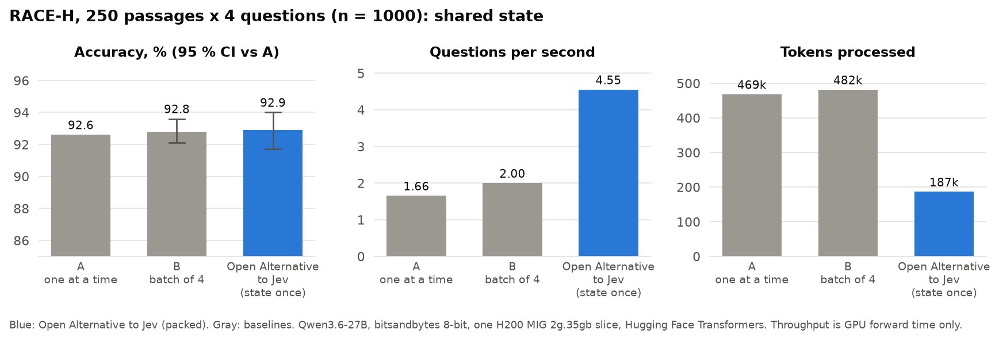
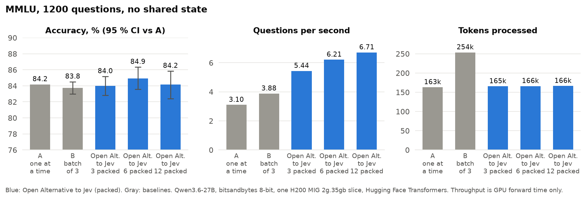
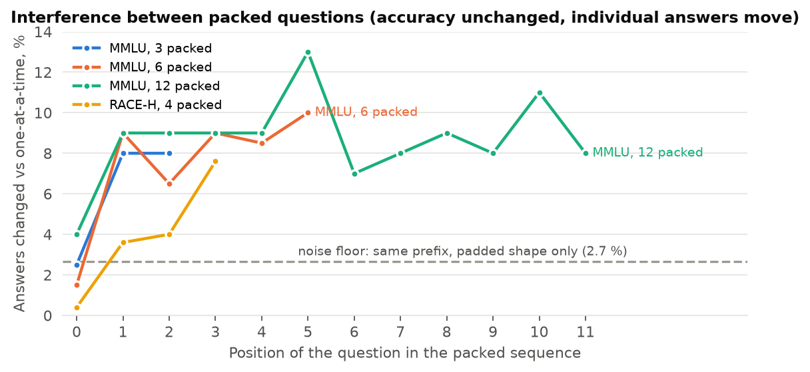
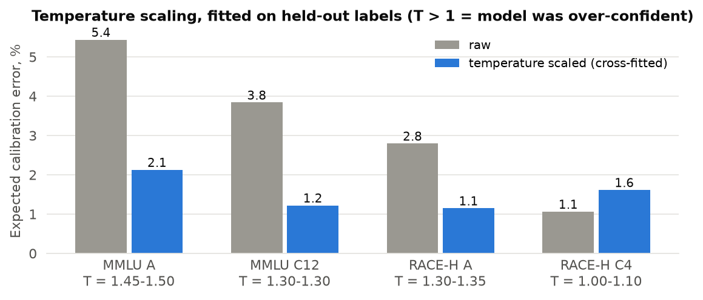

# Open Alternative to Jev

**Open-source System One models: typed, calibrated decisions from any open-weights LLM, in one forward pass.**
An open alternative to the idea behind TypeSafe's Jev, running on your own GPU with models you already have.
Python package `open-alternative-jev`, import name `so1` ("System One"). No text is generated: the model reads the state once and every question is answered from the next-token distribution at its own position, restricted to the options you give.

## Results

Qwen3.6-27B (bitsandbytes 8-bit), one H200 MIG slice with 35 GB, Hugging Face Transformers. Every number
below comes from `benchmarks/results/`, produced by the scripts in `benchmarks/scripts/`.

**RACE-H, 250 passages x 4 questions (n = 1000).** One passage, four multiple-choice questions.
This is the shared-state case the library is built for.

| Mode | Accuracy | Questions / s | Tokens processed |
|---|---:|---:|---:|
| A: one question per forward | 92.6 % | 1.66 | 468,583 |
| B: batch of 4 (padding) | 92.8 % | 2.00 | 481,924 |
| **Open Alternative to Jev** (packed, state written once) | **92.9 %** | **4.55** | **186,898** |



Packing writes the passage once instead of four times: 2.5x fewer tokens, 2.3x the throughput of batching,
same accuracy (Open Alternative to Jev minus A = +0.3 points, 95 % CI -0.9 to +1.4, bootstrap over passages).

**MMLU, 1200 questions, no shared state.** Accuracy holds up to 12 questions per sequence.

| Mode | Accuracy | Questions / s | Tokens processed |
|---|---:|---:|---:|
| A: one question per forward | 84.2 % | 3.10 | 163,032 |
| B: batch of 3 (padding) | 83.8 % | 3.88 | 253,638 |
| Open Alternative to Jev, 3 packed | 84.0 % | 5.44 | 165,432 |
| Open Alternative to Jev, 6 packed | 84.9 % | 6.21 | 166,032 |
| Open Alternative to Jev, 12 packed | 84.2 % | 6.71 | 166,332 |



Read the MMLU speed column carefully: without a shared state, packing does not reduce compute per token.
It is faster here because batch B wastes 36 % of its tokens on padding and because each forward call has a
fixed cost that packing amortizes. A serving engine with continuous batching and no padding would close
most of that gap. The RACE-H gain is structural and survives any engine.

> **The correction that made this README honest.** Our first pilot reported "1.4x faster than batching" on
> MMLU. Regressing forward time on token counts showed that B and C cost exactly the same per token
> (0.96 vs 0.97 ms) and that the whole difference was padding waste in the batch. We kept the pilot and the
> analysis in `benchmarks/docs/RESULTS.md` (Spanish) so you can check the reasoning, and we designed the
> RACE-H run so that the baseline had almost no padding (2.8 %).

### Interference: accuracy holds, individual answers move

Later questions in a packed sequence can attend to earlier questions and to the placeholders between them.
We measured the effect against a clean noise floor: the same prompt, one at a time, but right-padded to a
fixed length (`A_pad`) changes 2.7 % of answers purely through kernel numerics. Packing changes 6-9 %.



The changes are symmetric, so aggregate accuracy does not drop, but a given decision can differ depending
on which questions accompany it, and on their order (rotating the order changes 8 % of MMLU answers,
2.4 % of RACE-H answers). If you need answer-level stability, use `mode="separate"`.

### Calibration: one scalar, fitted on held-out labels

Raw confidence is about 5 points too high (mean confidence 0.90, accuracy 0.84 on MMLU). Temperature
scaling with a single scalar, fitted on one half and evaluated on the other, brings the expected
calibration error from 5.4 % to 2.1 % on MMLU and from 2.8 % to 1.1 % on RACE-H. Packed modes come out
less over-confident than one-at-a-time scoring; RACE-H packed was already close to calibrated (T = 1.0-1.1)
and scaling does not help it.



```python
from so1 import TemperatureScaler
scaler = TemperatureScaler().fit(probabilities, correct_indices)   # a few hundred labelled decisions
calibrated = [scaler.apply(d) for d in decisions]
```

## Quickstart

```python
from so1 import Decider, Choice, yes_no

decider = Decider.from_pretrained("Qwen/Qwen3.6-27B", backend="hf", load_in_8bit=True)
decisions = decider.decide(
    state="Ticket #8813: 'Since yesterday's release the export button does nothing. Board meeting Monday.'",
    questions=[
        Choice("Ticket category", ["bug", "feature request", "billing", "question"]),
        Choice("Urgency", ["low", "medium", "high"]),
        yes_no("Escalate to an engineer?"),
    ],
)
for d in decisions:
    print(d.choice, round(d.confidence, 2))   # bug 0.83 / high 0.71 / yes 0.77
```

The answer is always one of your options, and it comes with a probability.

## Install

```bash
pip install open-alternative-jev            # Hugging Face backend
pip install "open-alternative-jev[vllm]"    # + vLLM backend
pip install "open-alternative-jev[quant]"   # + bitsandbytes 8-bit / 4-bit loading
```

Python 3.10+. Works on CPU for small models (the test suite runs on Qwen2.5-0.5B on a laptop).

## How it works

```
<|im_start|>user
Choose the correct option. Reply with only its letter.

Context:
<your state>

Question: <question 1>
A. option   B. option   C. option<|im_end|>
<|im_start|>assistant
<think></think>            <- readout 1: next-token distribution over A/B/C
_<|im_end|>                <- fixed placeholder, never the model's own answer
<|im_start|>user
Answer the following question about the same context. Reply with only the letter.

Question: <question 2> ...<|im_end|>
<|im_start|>assistant
                           <- readout 2
```

1. Each question is rendered as a normal chat turn, so the model sees a format it was trained on.
2. The turns are concatenated into one token sequence with a fixed placeholder answer between them.
3. One forward pass; logits are read only at the readout positions (`logits_to_keep` on Transformers,
   `prompt_logprobs` on vLLM).
4. The logits of the option letters are normalized with a softmax. Nothing outside your options can win.
5. Optionally, a fitted temperature turns the raw probabilities into calibrated ones.

Two modes:

- `mode="packed"` (default): one sequence per state, all its questions inside. Fastest with a shared state.
- `mode="separate"`: one sequence per question, each with the full state. No interference between
  questions. On vLLM this uses constrained generation with `allowed_token_ids` and shares the state
  through the prefix cache, which is the conventional baseline.

## Backends

| | Hugging Face Transformers | vLLM |
|---|---|---|
| Load | `Decider.from_pretrained(id, backend="hf", load_in_8bit=True)` | `Decider.from_pretrained(id, backend="vllm", gpu_memory_utilization=0.85)` |
| Packed readout | exact logits at each position | top-k `prompt_logprobs` (k = 20); labels outside top-k get a floor, counted in `backend.missing_labels` |
| Separate readout | exact | exact (`allowed_token_ids` + processed logprobs) |
| Best for | measurement, quantized checkpoints, small GPUs | serving, throughput, long shared states |

Any model with a ChatML template (Qwen, and many fine-tunes) works out of the box. Other templates need a
`ChatFormat` with the strings that start a user turn and end an assistant turn.

## What this is not

- **Not a reproduction of Jev.** TypeSafe describes a dedicated architecture, sampler and training method.
  This library packages a capability that ordinary open models already have and that chat APIs hide.
  We make no claim about how Jev works or how it compares; the numbers above compare our own modes
  against each other on the same model.
- **Not calibrated out of the box.** Raw probabilities are over-confident. Fit a temperature on your data.
- **Not immune to context.** Packed answers depend, in 6-9 % of cases, on their neighbours. Use
  `mode="separate"` when a decision must not change with the batch it arrived in.
- **Not a speed record.** The absolute numbers come from an 8-bit model with the hybrid linear-attention
  layers running on PyTorch fallback kernels. The ratios between modes are the result; the absolute
  throughput is not.

## Reproduce

```bash
pip install -e ".[dev]"
pytest                                            # CPU, Qwen2.5-0.5B, ~10 s after download
python benchmarks/scripts/make_figures.py         # regenerate the figures from benchmarks/results
python benchmarks/scripts/prepare_v2.py           # rebuild the MMLU and RACE-H samples (pinned revisions)
python benchmarks/scripts/benchmark_v2.py --data race1000.jsonl --group-size 4 --modes A,B4,C4,C4_rot --out results/race
python benchmarks/scripts/library_compare.py --model Qwen/Qwen3.5-4B --backends hf,vllm --out results/lib
```

`benchmarks/docs/RESULTS.md` has the full write-up, including the pilot and its correction.

## License

Apache-2.0.
